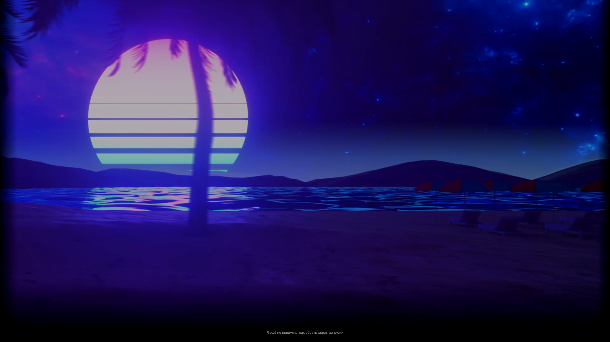
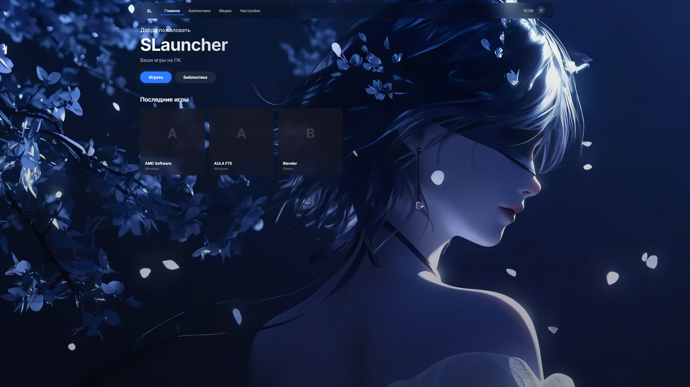
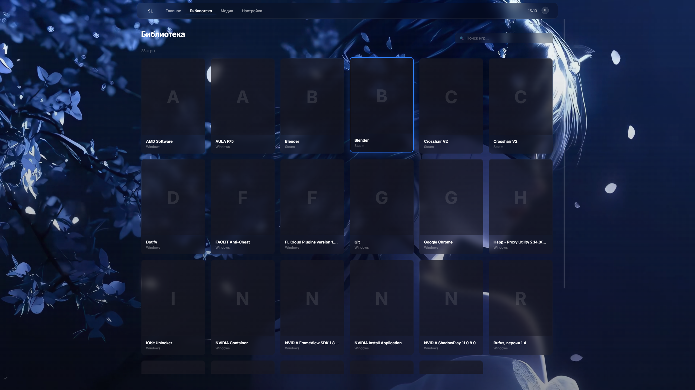
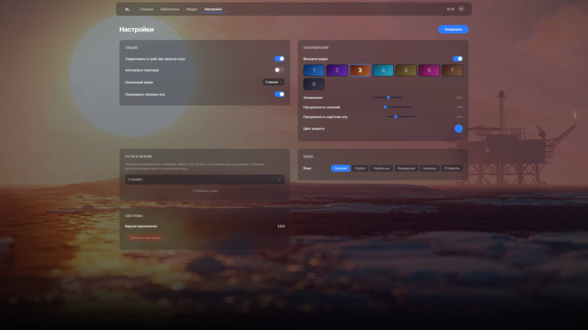

# SLauncher

Современный лаунчер для ПК-игр с продуманным интерфейсом, полной поддержкой геймпадов и автоматическим поиском установленных игр.

Стек: Rust + Tauri v2 + React + TypeScript + Vite.

## Возможности

- **Современный интерфейс** — полноэкранный режим, тёмная тема, плавные анимации, blur-панели, нижняя панель подсказок
- **Автоопределение игр** — сканирует Steam, Epic Games, реестр Windows и пользовательские папки
- **Геймпад** — полная поддержка DualSense, DualShock, Xbox и любых generic-геймпадов через Web Gamepad API
- **Медиа-просмотрщик** — скриншоты и видео с превью, удалением, навигацией
- **Мультиязычность** — русский, английский, украинский, белорусский, казахский, узбекский
- **Кастомизация** — цвет акцента, прозрачность панелей и карточек, фоновое видео, затемнение
- **Трей** — сворачивание в трей при запуске игры, меню в трее
- **Интро** — видео при запуске со случайными советами внизу экрана

## Скриншоты

| Экран загрузки | Главный экран |
|:---:|:---:|
|  |  |
| **Библиотека** | **Настройки** |
|  |  |

## Технологии

| Слой | Технология |
|------|------------|
| Интерфейс | React 19, TypeScript, Vite |
| Десктоп | Tauri v2 (Rust) |
| Стили | CSS (кастомная тёмная тема) |
| Шрифт | Inter (Google Fonts) |
| Геймпад | Web Gamepad API |
| Состояние | React hooks + Tauri invoke |

## Структура проекта

```
src/
├── App.tsx                # Корневой компонент, роутинг экранов, геймпад
├── App.css                # Все стили (тёмная тема)
├── locales.ts             # Переводы (ru, en, uk, be, kk, uz)
├── hooks/
│   ├── useGamepad.ts      # Опрос геймпада, маппинг кнопок, клавиатура
│   ├── useGames.ts        # Сканирование и запуск игр
│   └── useLocale.ts       # Контекст локализации
├── components/
│   ├── VideoIntro.tsx     # Интро-видео со случайными фразами
│   ├── GamesLibrary.tsx   # Библиотека игр с поиском и сеткой
│   ├── MediaScreen.tsx    # Экран медиа с последними играми
│   ├── MediaViewer.tsx    # Сетка скриншотов/видео и плеер
│   ├── SettingsScreen.tsx # Все настройки (сохраняются в config.json)
│   └── ControllerIcons.tsx # Загрузчик SVG-иконок (PS/Xbox)
├── types.ts               # Общие типы
└── main.tsx               # Точка входа

src-tauri/
├── src/
│   ├── lib.rs             # Точка входа, трей, регистрация команд
│   ├── config.rs          # AppConfig (14 полей), загрузка/сохранение
│   ├── games.rs           # Сканирование (Steam/Epic/реестр/папки), запуск
│   └── media.rs           # Сканирование медиа, превью, удаление
├── Cargo.toml
├── tauri.conf.json
└── capabilities/default.json
```

## Быстрый старт

### Требования

- [Node.js](https://nodejs.org/) 18+
- [Rust](https://rustup.rs/)
- [Tauri CLI](https://v2.tauri.app/start/cli/): `cargo install tauri-cli --version "^2"`

### Запуск в разработке

```bash
npm install
npm run tauri dev
```

Или просто запустите `run.bat` (без консольного окна).

### Сборка

```bash
npm run tauri build
```

Готовый установщик появится в `src-tauri/target/release/bundle/`.

## Настройки

Файл `config.json` сохраняется рядом с исполняемым файлом.

| Поле | По умолчанию | Описание |
|------|-------------|----------|
| `bg_video` | `S1.mp4` | Фоновое видео |
| `bg_video_enabled` | `true` | Включить фоновое видео |
| `bg_dimmed` | `0.8` | Затемнение фона (0–1) |
| `ui_opacity` | `0.85` | Прозрачность панелей |
| `game_card_opacity` | `0.8` | Прозрачность карточек игр |
| `accent_color` | `#2d7aff` | Цвет акцента |
| `start_screen` | `home` | Стартовый экран |
| `show_game_covers` | `true` | Показывать обложки Steam |
| `hints_visible` | `true` | Подсказки геймпада |
| `language` | `ru` | Язык интерфейса |
| `auto_launch` | `false` | Автозапуск |
| `minimize_to_tray` | `true` | Сворачивать в трей при запуске игры |
| `game_paths` | `[]` | Дополнительные папки с играми |
| `recent_games` | `[]` | Недавно запущенные игры (авто) |

## Управление с геймпада

| Кнопка | Действие |
|--------|----------|
| Cross / A | Подтвердить |
| Circle / B | Назад |
| Square / X | Поиск (библиотека) |
| Triangle / Y | Скрыть/показать подсказки |
| LB / RB | Переключение вкладок |
| Крестовина / Стики | Навигация |

## Заметки

Фоновые видео (`public/bg/S1.mp4`–`S8.mp4`) не включены в репозиторий — поместите свои `.mp4` файлы в эту папку.  
Интро-видео помещается в `public/intro/intro.mp4`.

## Лицензия

[MIT](LICENSE)
